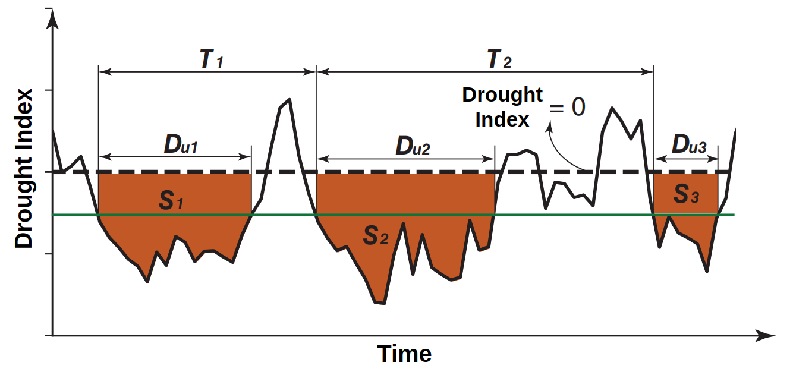
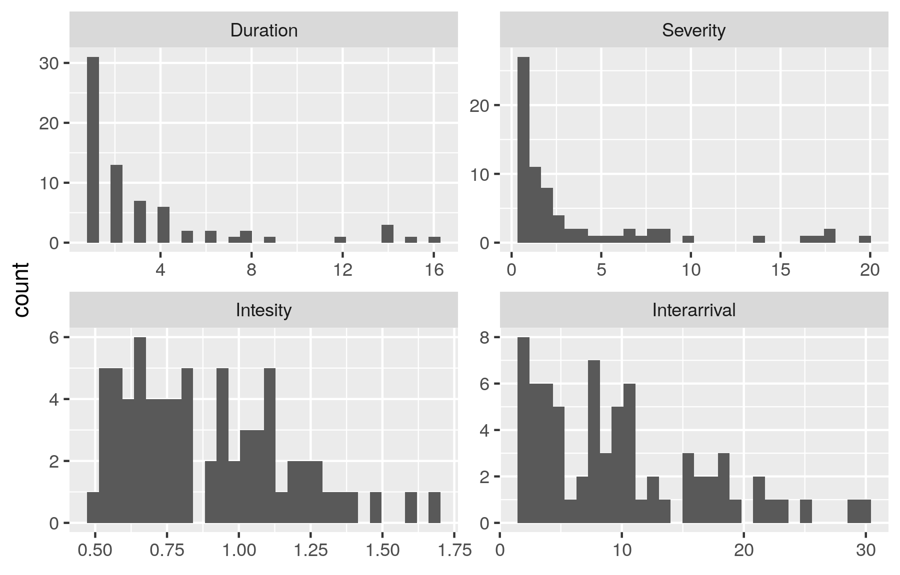

# drought_features

Drought is usually studied trough indices which can be characterized in many ways. Here is show the use of the run theory to characterize a drought index (SPI).

## Drought characteristics (run theory)

Many drought indices have been proposed in the literature, such as SPI, SPEI, PDSI, and others. The selection of one specific index is frequently based on the availability of data. Although the definition (and interpretation) is quite different in each index, the majority of them can be characterized using the run theory approach. 

The theory of runs is first proposed in [Yevjevich (1967)](https://mountainscholar.org/bitstream/handle/10217/61303/HydrologyPapers_n23.pdf;sequence=1) and has been employed to recognize the feature of droughts (Figure 1): **duration**, **severity**, **intensity**, and **interarrival** (see [Le et al. 2019](https://www.researchgate.net/publication/333171255_Space-time_variability_of_drought_over_Vietnam) for a better explanation and others).

  

*Figure 1. Illustration of drought events and characteristics based on run theory ([Yevjevich 1967](https://mountainscholar.org/bitstream/handle/10217/61303/HydrologyPapers_n23.pdf;sequence=1)). Du is duration, T is inter-arrival time, and S is severity. Modified figure from [Le et al. 2019](https://www.researchgate.net/publication/333171255_Space-time_variability_of_drought_over_Vietnam).*

## Example

Using synthetic precipitation data, the SPI index has been calculated. Later, the *run_theory* function is applied with a threshold of -.5. All this process is developed in **example.R**. A simple plot of the features is given in Figure 2. 

  

*Figure 2. Count of values of Severity, Duration, Intensity, and Interarrival from synthetic SPI.*

Using these features is easy to describe a drought index, understanding the spatio-temporal variability of them lets us understand more a drought. Also, there are many ways in which these features can be used, for instance,  multivariate frequency analysis with copulas.

It should mention that run theory is not only applied to drought indices but also, to other indices or variables. Thus, there are a lot of applications.

## References

Yevjevich, V. M. (1967). Objective approach to definitions and investigations of continental hydrologic droughts, An. Hydrology papers (Colorado State University); no. 23.

Le, P. V., Phan‐Van, T., Mai, K. V., & Tran, D. Q. (2019). Space–time variability of drought over Vietnam. International Journal of Climatology, 39(14), 5437-5451.